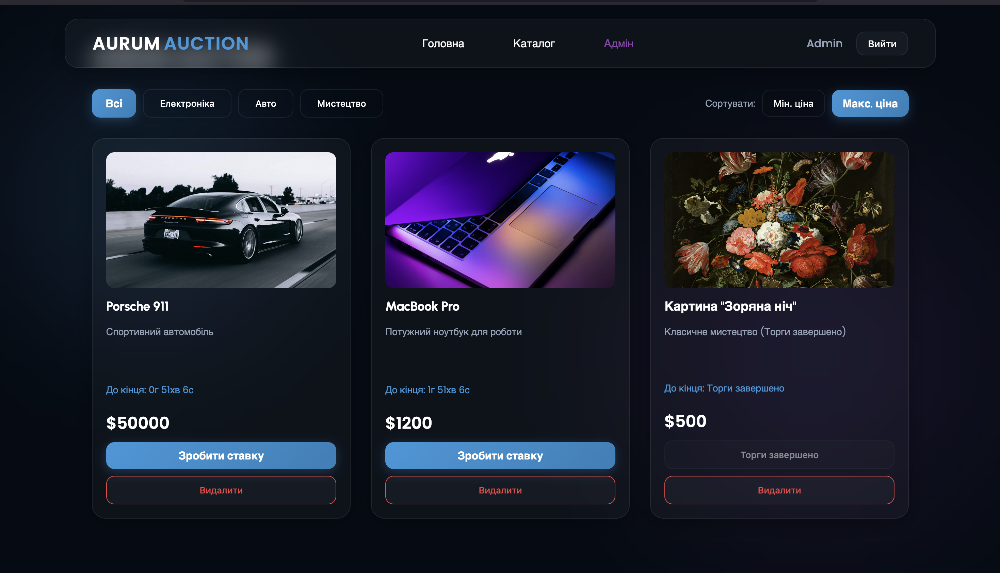
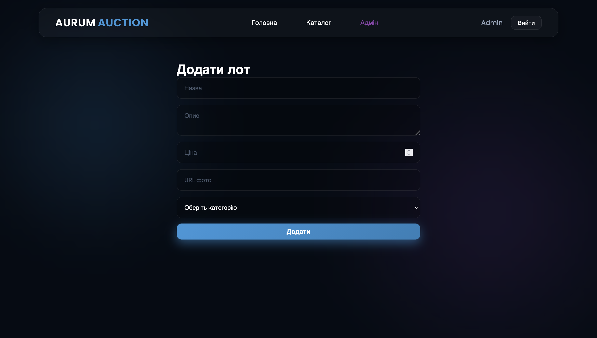
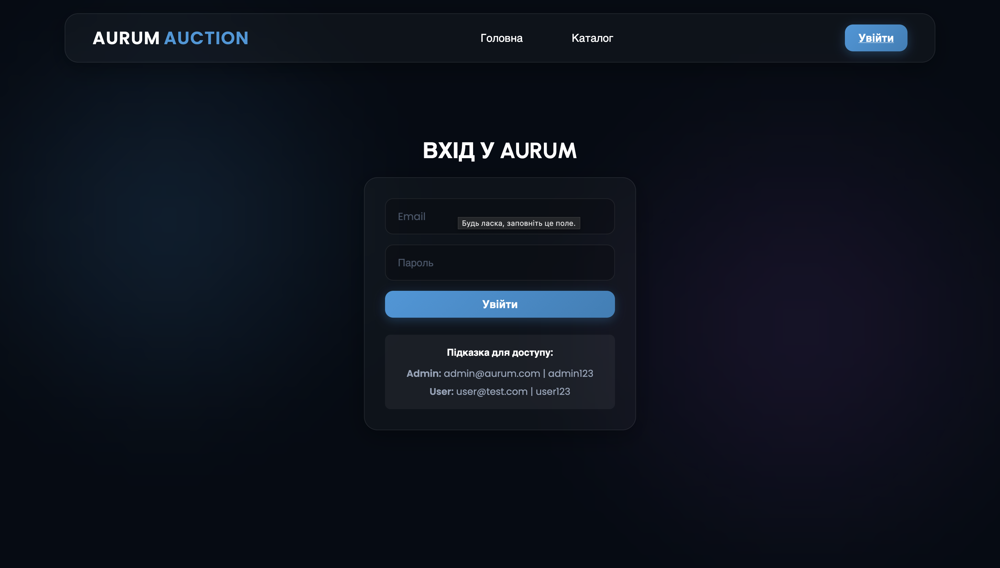

# AURUM AUCTION - Платформа для онлайн-аукціонів

## Назва
**AURUM AUCTION** — це сучасна CRM та веб-система для проведення онлайн-аукціонів, управління лотами та ставками в реальному часі із застосуванням Glassmorphism дизайну.

## УРЛ
**Live URL:** (https://aurum-auction-client.vercel.app)](https://aurum-auction-app.onrender.com/)

## Стек технологій

- **Frontend:** React.js, React Router
- **Backend:** Node.js, Express.js
- **База даних:** SQLite3 (Реляційна БД)
- **Дизайн/Стилізація:** CSS3 (Glassmorphism UI)
- **Архітектура:** SPA + REST API

## Функції
Система забезпечує повний цикл управління онлайн-аукціоном:
- **Управління лотами:** Додавання нових лотів з описом, фотографіями та стартовою ціною. Видалення лотів адміністратором.
- **Таймери реального часу:** Автоматичний розрахунок часу до завершення торгів (за замовчуванням 24 години для нових лотів).
- **Захищена система ставок:** Подвійна валідація (на клієнті та сервері), яка блокує ставки, якщо час торгів вийшов, або якщо сума менша за поточну.
- **Динамічний каталог:** Фільтрація лотів за категоріями (Електроніка, Авто, Мистецтво) та миттєве сортування за ціною (Мін. ціна / Макс. ціна).
- **Демо-режим:** Автоматична генерація тестових лотів з різним статусом часу (активні та завершені) при розгортанні порожньої бази даних.
- **Рольова система доступу:** Розмежування прав між Адміністратором та звичайним Користувачем (Клієнтом).

## Авторизація
**Сторінка авторизації:** `/login`

Система використовує локальне сховище (Local Storage) для збереження сесії користувача після успішної перевірки на бекенді.

### Ролі та доступ:
1. **Admin (Адміністратор):** Має повний доступ до всіх функцій. Може переглядати каталог, робити ставки, а також має ексклюзивне право створювати нові лоти (сторінка "Адмін") та видаляти існуючі.
   - **Логін:** `admin@aurum.com`
   - **Пароль:** `admin123`

2. **Client (Користувач/Учасник):** Може переглядати каталог, фільтрувати лоти, бачити час до завершення торгів та робити власні ставки. Не має доступу до панелі створення та видалення лотів.
   - **Логін:** `user@test.com`
   - **Пароль:** `user123`

3. **Guest (Гість):** Неавторизований користувач. Може лише переглядати каталог та слідкувати за часом, але при спробі зробити ставку отримує вимогу авторизуватися.

---

## Сторінки проекту

### 1. Каталог лотів (Catalog / Home)
- **УРЛ:** `/` або `/lots`
- **Опис:** Головна сторінка аукціону. Містить список усіх лотів у вигляді стильних карток. Дозволяє фільтрувати товари за категоріями, сортувати за ціною, бачити живий таймер та робити ставки.
- **Скріншот:**
  

### 2. Панель Адміністратора (Admin Dashboard)
- **УРЛ:** `/admin`
- **Опис:** (Тільки для Admin). Сторінка з формою для додавання нового лоту. Вимагає введення назви, опису, ціни, URL-фотографії та вибору категорії. Таймер на 24 години встановлюється автоматично.
- **Скріншот:**
  

### 3. Авторизація (Login)
- **УРЛ:** `/login`
- **Опис:** Форма для входу в систему. 
- **Скріншот:**
  

---

# Node.js API (Backend)

Усі API ендпоінти знаходяться у файлі:

```text
backend/server.js

```

Для управління базою даних та генерації демо-даних використовується `backend/database.js`.

---

## API Можливості

| Метод | Ендпоінт | Опис |
| --- | --- | --- |
| GET | `/api/lots` | Отримання списку лотів (з підтримкою `?category=` та `?sort=`) |
| POST | `/api/lots` | Створення нового лоту (встановлює `end_time` на +24 години) |
| DELETE | `/api/lots/:id` | Видалення конкретного лоту (лише для Admin) |
| POST | `/api/bids` | Створення ставки (перевіряє час та оновлює `current_price`) |
| POST | `/api/login` | Перевірка email та пароля користувача |

## Структура файлів у проекті

```text
AURUM_AUCTION/
├── backend/
│   ├── database.js         ← Налаштування SQLite, створення таблиць, демо-лоти
│   ├── server.js           ← Node.js + Express REST API
│   ├── auction.db          ← Файл локальної реляційної бази даних
│   ├── package.json        
│   └── node_modules/
├── frontend/
│   ├── public/
│   ├── screenshots/        ← Папка зі скріншотами для документації
│   │   ├── catalog.png
│   │   ├── admin.png
│   │   └── login.png
│   ├── src/
│   │   ├── components/
│   │   │   └── Countdown.jsx ← Логіка таймера реального часу
│   │   ├── pages/
│   │   │   ├── Catalog.jsx
│   │   │   └── Admin.jsx
│   │   ├── App.jsx
│   │   ├── App.css         ← Glassmorphism стилі
│   │   └── main.jsx
│   ├── package.json        ← React dependencies
│   └── vite.config.js      ← Vite configuration
└── PROJECT_DOCS.md         ← Цей файл документації
